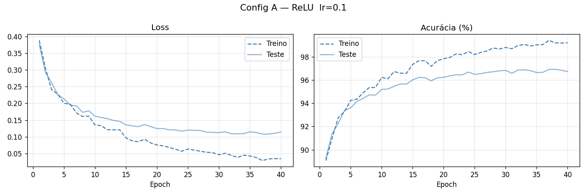
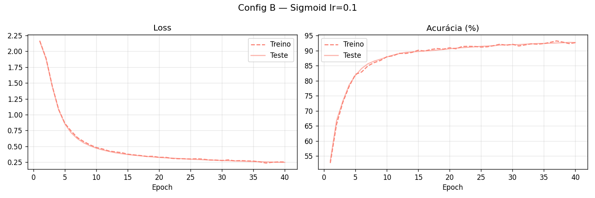
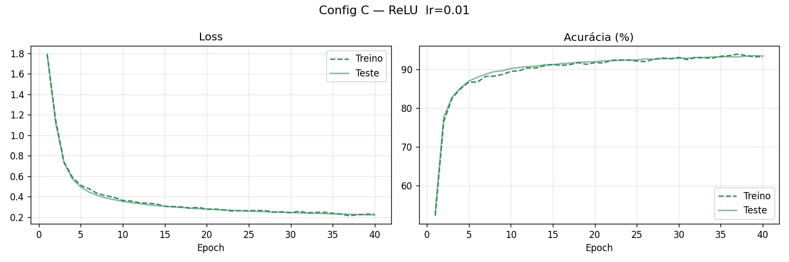
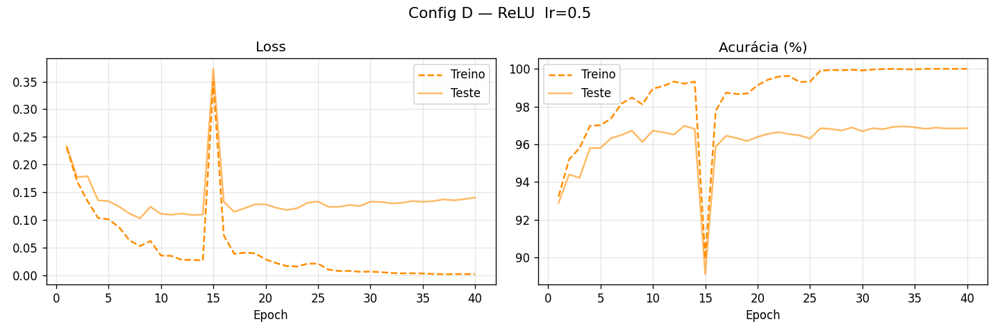
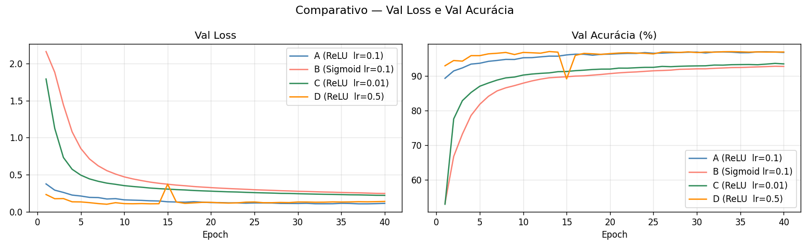
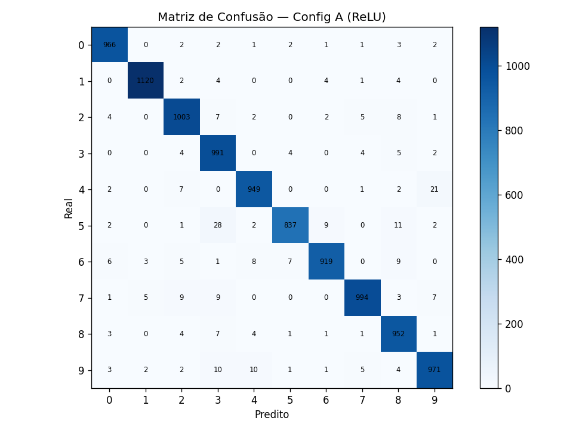

# MLP do Zero — MNIST

Implementação de um Multi-Layer Perceptron (MLP) construído do zero, usando apenas NumPy, para classificação dos 10 dígitos manuscritos do dataset MNIST. 

A rede é organizada em módulos separados (`MLP/activations.py`, `losses.py`, `optimizers.py`, `network.py`) e os experimentos ficam no notebook `notebook/experimentacao.ipynb`, onde são comparadas quatro configurações variando ativação e learning rate.

---

## Como Rodar

```bash
pip install -r requirements.txt
jupyter notebook notebook/experimentacao.ipynb
```

---

## Arquiteturas testadas

**Configuração A:**

| Hiperparâmetro | Valor |
|---|---|
| Camadas ocultas | 2 (64 e 32 neurônios) |
| Ativação | ReLU |
| Inicialização de pesos | He (`√(2/n_in)`) |
| Learning rate | 0.1 |
| Batch size | 256 |
| Épocas | 40 |

**Configuração B:**

| Hiperparâmetro | Valor |
|---|---|
| Camadas ocultas | 2 (64 e 32 neurônios) |
| Ativação | **Sigmoid** |
| Inicialização de pesos | He (`√(2/n_in)`) |
| Learning rate | 0.1 |
| Batch size | 256 |
| Épocas | 40 |

**Configuração de comparação (Config C):**

| Hiperparâmetro | Valor |
|---|---|
| Camadas ocultas | 2 (64 e 32 neurônios) |
| Ativação | ReLU |
| Inicialização de pesos | He (`√(2/n_in)`) |
| Learning rate | **0.01** |
| Batch size | 256 |
| Épocas | 40 |

**Configuração de comparação (Config D):**

| Hiperparâmetro | Valor |
|---|---|
| Camadas ocultas | 2 (64 e 32 neurônios) |
| Ativação | ReLU |
| Inicialização de pesos | He (`√(2/n_in)`) |
| Learning rate | **0.5** |
| Batch size | 256 |
| Épocas | 40 |

---

## Decisões na Montagem da Rede

**2 camadas ocultas (64 → 32):** A segunda camada nos permite que a rede observe padrões mais complexos e abstratos: a primeira detecta traços, a segunda os combina em formas.

**Inicialização He:** ReLU zera metade dos neurônios em média, o que reduziria a variância do sinal pela metade a cada camada com inicialização padrão. He corrige isso escalando por `√(2/n_in)`, mantendo a variância estável em profundidade.

**batch=256 e 40 épocas:** 256 é padrão confiável para SGD sem ajuste fino. 40 épocas porque a val_loss ainda caía levemente na metade do treino e estabilizou nas épocas finais, sem overfitting.

**32k exemplos de treino:** O dataset completo tem 60k exemplos. Treinar em todos eles tornava cada rodada de experimentos muito lenta para iterar. Limitei a 32k selecionados aleatoriamente, o que manteve a acurácia em nível satisfatório e permitiu experimentar com mais configurações no mesmo tempo.

---

## Resultados

### Acurácia Final no Conjunto de Teste

| Config | Arquitetura | Ativação | lr | Acurácia (40 épocas) |
|---|---|---|---|---|
| A | [784, 64, 32, 10] | ReLU | 0.1 | **96.73%** |
| B | [784, 64, 32, 10] | Sigmoid | 0.1 | 92.70% |
| C | [784, 64, 32, 10] | ReLU | 0.01 | 93.43% |
| D | [784, 64, 32, 10] | ReLU | 0.5 | 96.85% |

### Curvas de Treinamento











#### Análise das curvas

**Config A (ReLU, lr=0.1):** loss cai de forma suave e consistente ao longo das 40 épocas, sem oscilações relevantes. O gap entre treino e teste é pequeno e estável, indicando boa generalização sem overfitting significativo. A acurácia de validação sobe gradualmente e estabiliza perto das épocas finais.

**Config B (Sigmoid, lr=0.1):** a loss começa muito mais alta (~0.8 vs ~0.4 da Config A na época 1) e cai mais lentamente.

**Config C (ReLU, lr=0.01):** a curva de loss tem forma similar à da Config B em velocidade, mesmo usando ReLU. Isso confirma que o gargalo aqui é o learning rate baixo. A acurácia progride de forma linear e previsível, sem saltos. Precisaria de muitas mais épocas para atingir as métricas da Config A.

**Config D (ReLU, lr=0.5):** a loss despenca nas primeiras 5 épocas mais rápido do que qualquer outra config, mas com oscilação visível. O gradiente "salta" ao redor do mínimo em vez de descer suavemente. Apesar de chegar perto da Config A em acurácia, o gap entre loss de treino e teste é ligeiramente maior nas épocas finais, sugerindo que o lr alto pode estar impedindo a rede de assentar num mínimo estável.

### Por que escolhi a Config A como modelo final

Apesar da Config D ter chegado a uma acurácia muito próxima da Config A, a Config A foi escolhida como modelo final por duas razões principais:

1. **Curva mais estável:** a loss da Config A desce sem grandes oscilações. Isso indica que o modelo está aprendendo de forma consistente.

2. **Interpretabilidade do treino:** com Config A é mais fácil diagnosticar problemas: se a loss parar de cair, sabemos que não é culpa do lr alto. Com Config D, qualquer anomalia na curva tem ambiguidade.

### Matriz de Confusão — Config A (melhor modelo)



A matriz revela padrões de erro consistentes com a estrutura visual dos dígitos:

- **4 → 9** é o erro mais frequente: diferenciação depende de detalhes finos da caligrafia que o modelo trata como pixels planos.
- **3 → 5** e **5 → 3** as duas curvas abertas à direita são muito parecidas. A diferença entre os números está no traço superior, que varia muito entre escritores.
- **7 → 1** e **7 → 2** escritores que não cruzam o 7 facilitam a confusão com o 1 e o 2.
- O dígito **8** tem erros bem diversos sendo confundido com 3, 5 e 9 dependendo de onde a caligrafia fecha (ou não) os dois laços.

O fato de os erros seguirem exatamente essas similaridades visuais entre os números indica que o modelo aprendeu representações geometricamente coerentes.

---

## Decisões e Dificuldades

### 1. Qual foi a decisão técnica mais difícil que tomei?

A decisão mais difícil de escolher foi o número de neurônios em cada camada oculta. Optei por uma estrutura que vai reduzindo gradualmente para não comprimir toda a informação de uma vez. 64 neurônios na primeira camada é o suficiente para capturar padrões locais (traços, curvas) sem subir demais o custo de treino. 32 na segunda comprime mais, forçando a rede a guardar só o que é realmente relevante para distinguir os 10 dígitos. Cogitei usar 128 e 64, mas pelo MNIST ser grande o treino levaria mais do dobro do tempo, fazendo essa alternativa bem mais difícil de iterar. A decisão se baseou no equilíbrio entre possível melhora na acurácia e a viabilidade de experimentar várias vezes.

### 2. O que tentei que não funcionou?

Tentei alterar o learning rate com a ilusão de que diminuí-lo sempre melhoraria o resultado. No meu entendimento, um learning rate menor deixaria o modelo mais preciso. Porém, ao realizar os testes percebi que com lr=0.01 o modelo precisaria de muitas mais épocas para se estabilizar, tornando o treino inviável no meu computador dentro do tempo disponível.

Além disso, no início tentei treinar com todos os 60k exemplos do MNIST, o que tornou cada rodada de experimentos muito lenta. Limitei a 32k exemplos selecionados aleatoriamente, o que manteve a acurácia satisfatória e permitiu iterar com muito mais agilidade.

### 3. Se fosse refazer do zero, o que faria diferente?

Se fosse refazer do zero, separaria o conjunto de validação do conjunto de teste desde o início. No projeto atual, o X_test (10k exemplos) é usado tanto para monitorar o treino época por época quanto para a avaliação final do modelo. O correto seria separar treino e validação, e manter os 10k de teste completamente intocados até a avaliação final. Assim a acurácia reportada seria uma estimativa honesta de como o modelo se comporta em dados que nunca influenciaram nenhuma decisão.

---

## Estrutura do Repositório

```
.
├── README.md
├── requirements.txt
├── MLP/
│   ├── __init__.py
│   ├── network.py       ← MLP: forward, backward, update
│   ├── activations.py   ← ReLU, Sigmoid, Softmax e derivadas
│   ├── losses.py        ← Cross-entropy
│   └── optimizers.py    ← SGD
├── notebook/
│   └── experimentacao.ipynb
└── resultados/
    ├── config_a_curvas.png
    ├── config_b_curvas.png
    ├── config_c_curvas.png
    ├── config_d_curvas.png
    ├── comparativo_configs.png
    └── matriz_confusao.png
```

